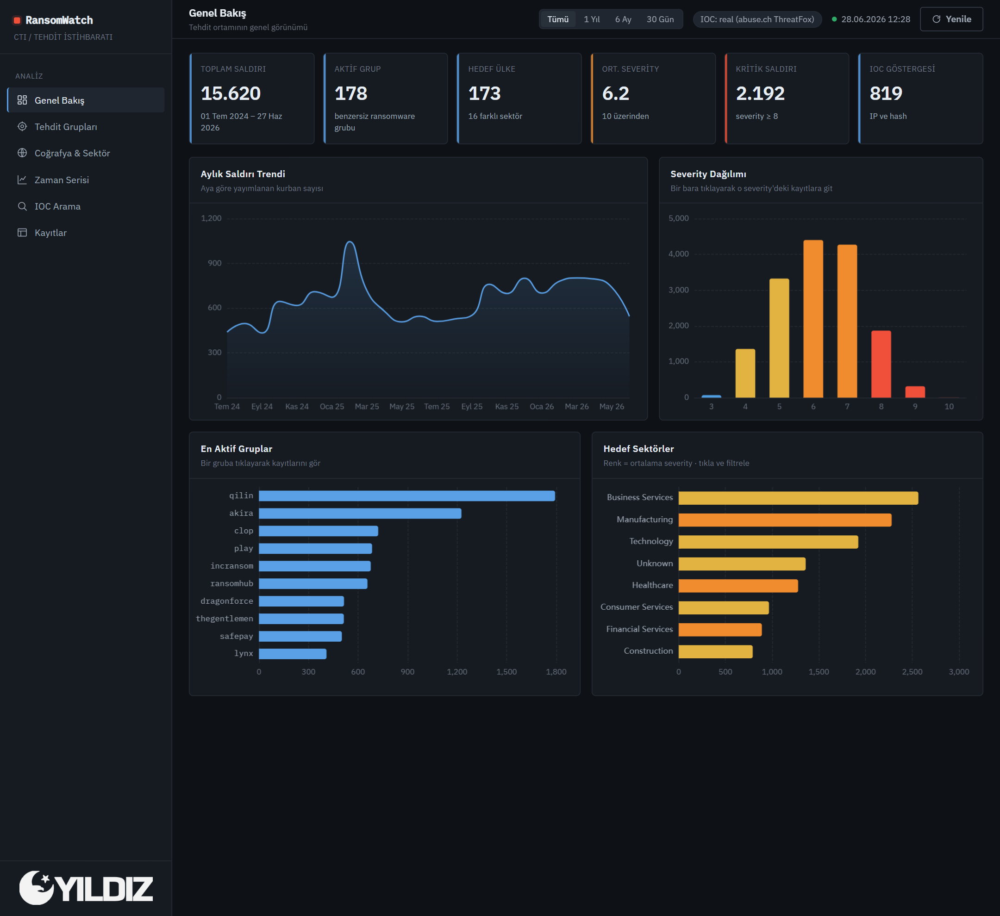
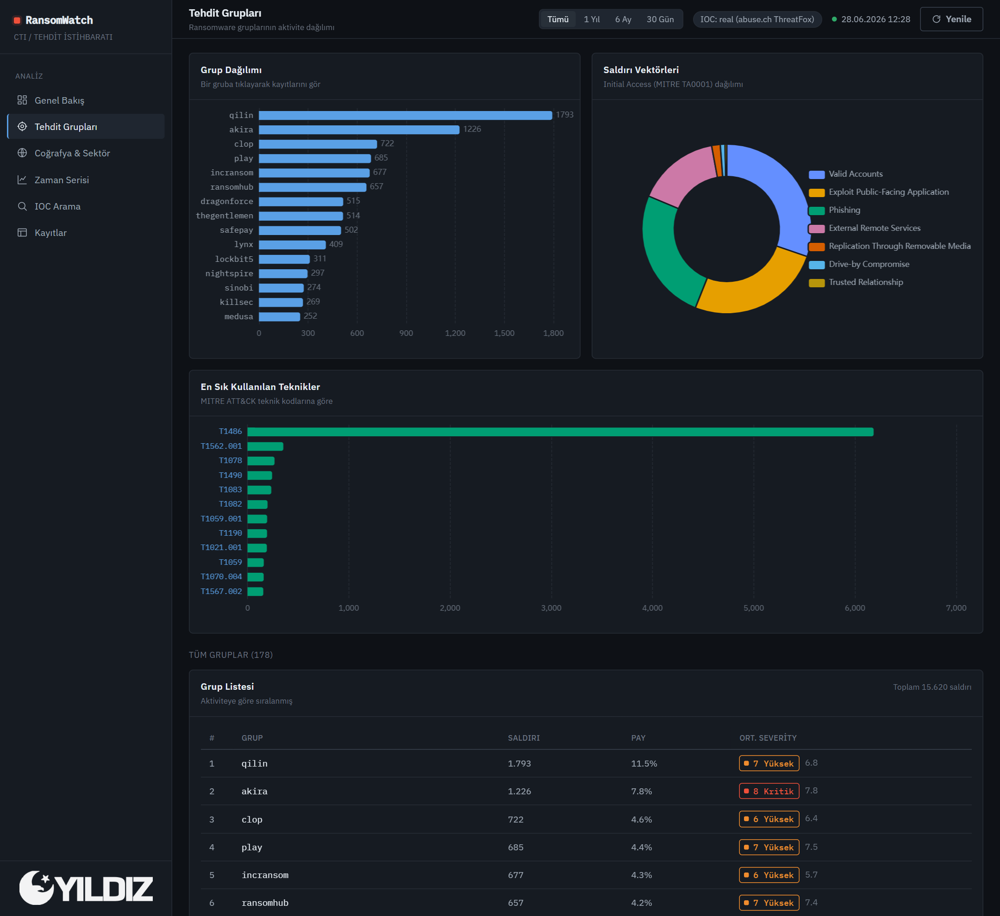
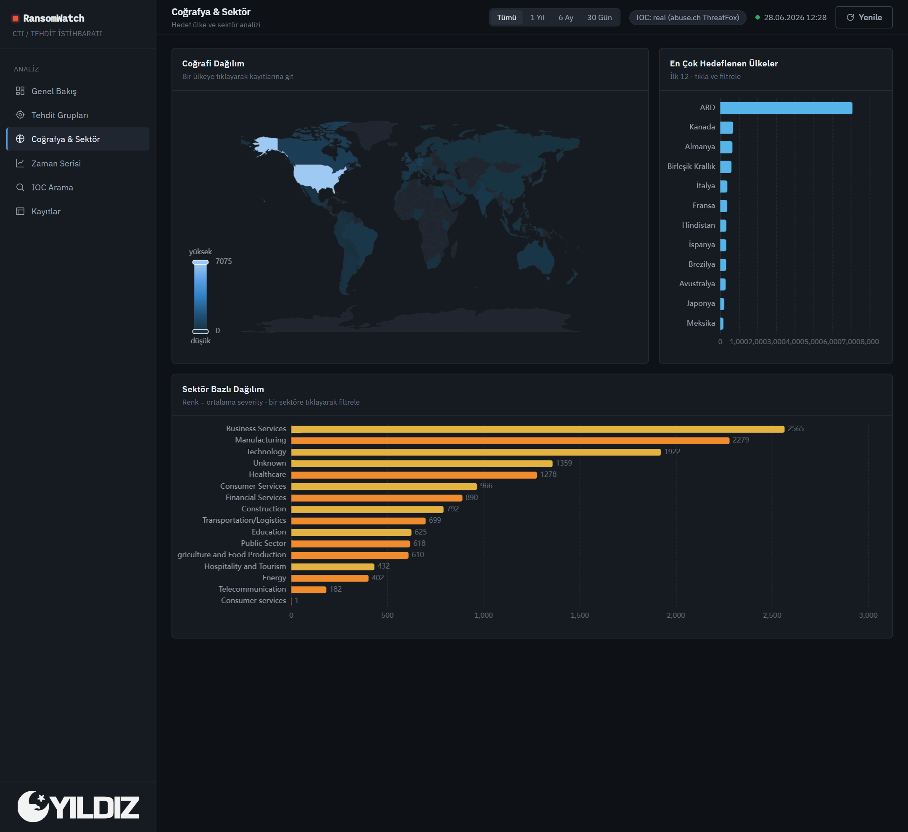
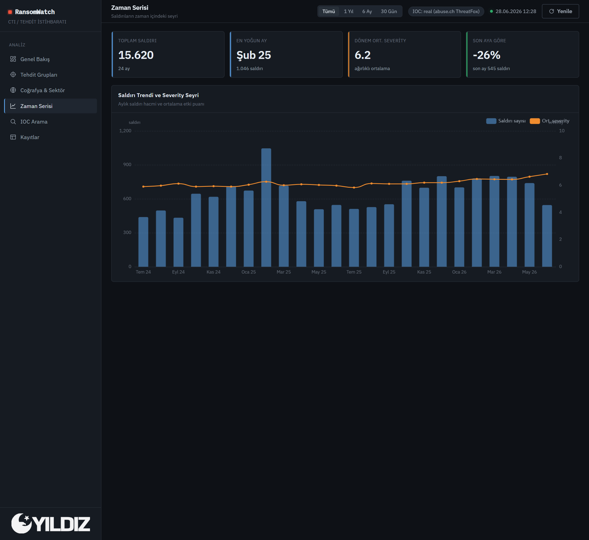
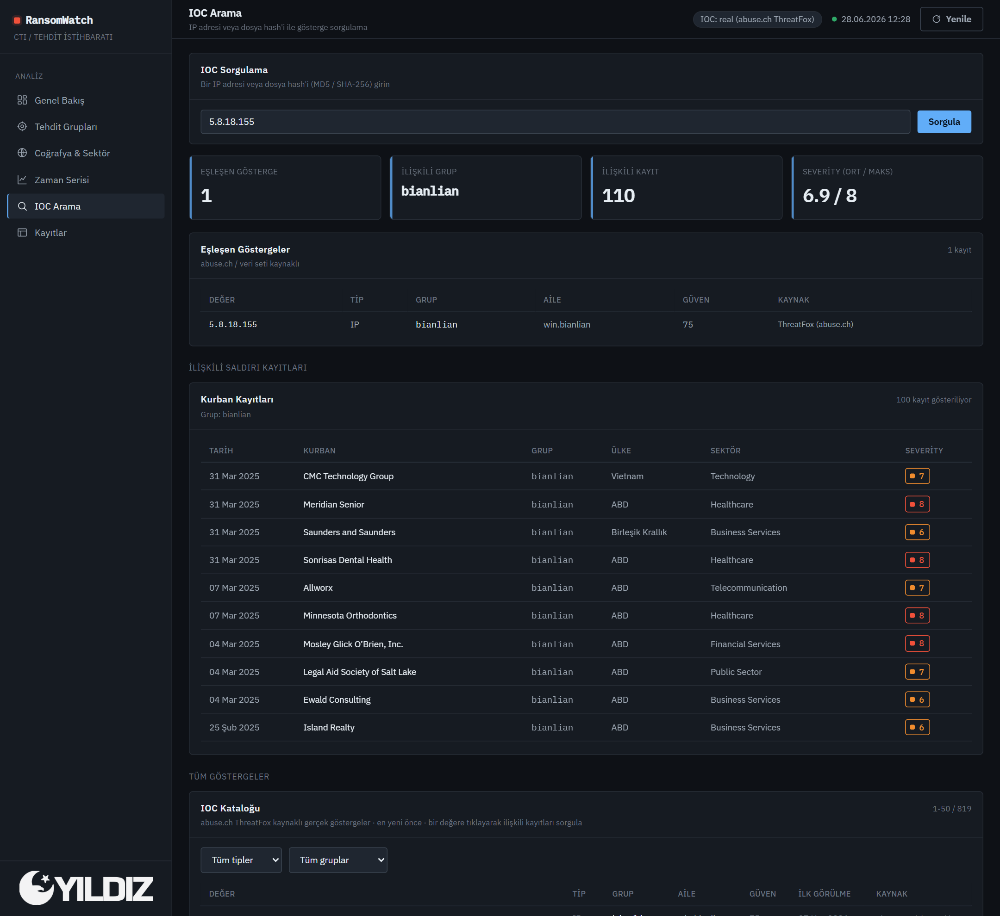
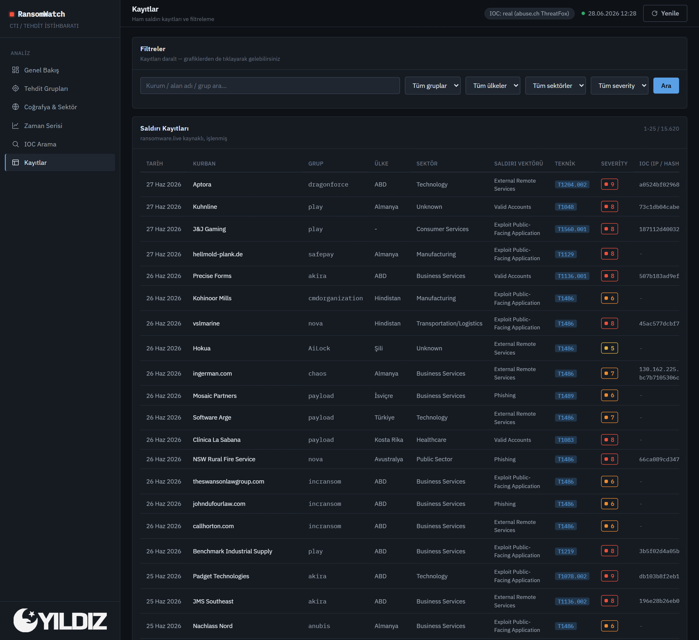

<div align='center'>

<h1>Ransomware Monitoring Dashboard</h1>
<h4> Canlı API'lerden Beslenen Siber Tehdit İstihbaratı (CTI) Panosu  </h4>

</div>

###  Proje Hakkında

Bu proje; açık kaynaklı tehdit istihbaratı (OSINT) kaynaklarını tarayarak fidye yazılımı (ransomware) saldırılarını anlık izleyen, analiz eden ve bunları karanlık/modern bir arayüzde görselleştiren bir **Cyber Threat Intelligence (CTI)** panosudur. 

Sistem; saldırı düzenleyen grupları, hedef alınan ülkeleri, sektörleri ve zaman serisi trendlerini analiz eder. Her kurban kaydı için arka planda savunulabilir bir **severity (1–10 kritiklik) puanı** hesaplar ve şüpheli IP veya dosya hash'lerini sorgulayabileceğiniz bir **IOC arama modülü** barındırır.

> **Önemli detay:** Projede hazır veya statik bir Kaggle veri seti kullanılmadı. Veriler; ransomware.live, abuse.ch ve MITRE ATT&CK olmak üzere üç farklı canlı API'den anlık çekilip akıllıca birleştirilir.

---

###  Ekran Görüntüleri

<details>
<summary><b>Görselleri Görüntülemek İçin Tıklayın</b></summary>
<br>

#### Genel Bakış


#### Tehdit Grupları


#### Coğrafya & Sektör


#### Zaman Serisi


#### IOC Arama


#### Kayıtlar


</details>

---

###  Özellikler

- **Çoklu Canlı API Entegrasyonu:** Üç farklı kaynaktan veri birleştirme.
- **Dinamik Severity Hesaplama:** CVSS v4 mantığıyla çalışan önceliklendirme algoritması.
- **Gelişmiş Dashboard:** ECharts ile hazırlanan 4+ etkileşimli grafik (Harita, Çift Eksen Zaman Serisi vb.).
- **IOC Arama ve Atıf (Attribution):** IP/Hash üzerinden saldırı grubu tespiti.
- **Otomatik & Manuel Veri Yenileme:** Arayüzden tek tıkla veya arka planda 24 saatlik periyotlarla veri tazeleme.

---

##  Teknolojiler

Proje, minimum bağımlılık ve maksimum hız felsefesiyle şu teknolojilerle geliştirildi:

- **Go (Golang):** Hem veri toplama (pipeline) hem de REST API (server) tarafında tek statik binary gücü.
- **React + TypeScript + Vite:** Hızlı ve modern ön yüz mimarisi.
- **Apache ECharts:** Performanslı ve interaktif veri görselleştirme.
- **SQLite (WAL):** CGO bağımlılığı olmayan, sunucu gerektirmeyen gömülü veri tabanı.
- **Docker & Docker Compose:** Tek komutla ayağa kalkan izole mimari.

---

##  Severity (Kritiklik) Hesaplama Mantığı

Sistem, ham veride bulunmayan risk puanını, CVSS v4'ün katmanlı yapısını taklit eden ağırlıklı bir formülle kendisi türetir. Formül şu bileşenlerin 0-10 arasına normalize edilip toplanmasıyla çalışır:

$$severity = \text{clamp}\left(1, 10, \; 0.30 \cdot S + 0.25 \cdot G + 0.15 \cdot E + 0.15 \cdot T + 0.15 \cdot I\right)$$

- **Sektör - %30:** CISA'nın 16 kritik altyapı tanımına uygunluk.
- **Grup Aktivitesi - %25:** Grubun toplam kurban sayısındaki logaritmik payı.
- **MITRE Etki Tekniği - %15:** Profilde şifreleme/zarar verme tekniği (T1486 vb.) var mı?
- **Tazelik - %15:** Saldırı tarihinin güncelliği (üstel azalma ile eskiyen veri sönümlenir).
- **IOC Varlığı - %15:** Grupla eşleşen aktif zararlı göstergesi var mı?

---

###  Önkoşullar

- Bilgisayarınızda Docker ve Docker Compose kurulu olmalıdır. ([İndirmek için tıkla](https://www.docker.com/products/docker-desktop/))

---

###  Kurulum ve Çalıştırma

#### Seçenek 1: Docker ile Hızlı Başlangıç (Önerilen)

Projeyi indirdikten sonra terminalde ana dizine gelip şu komutu çalıştırın:

```bash
docker compose up --build 
```
Pano: http://localhost:8080
